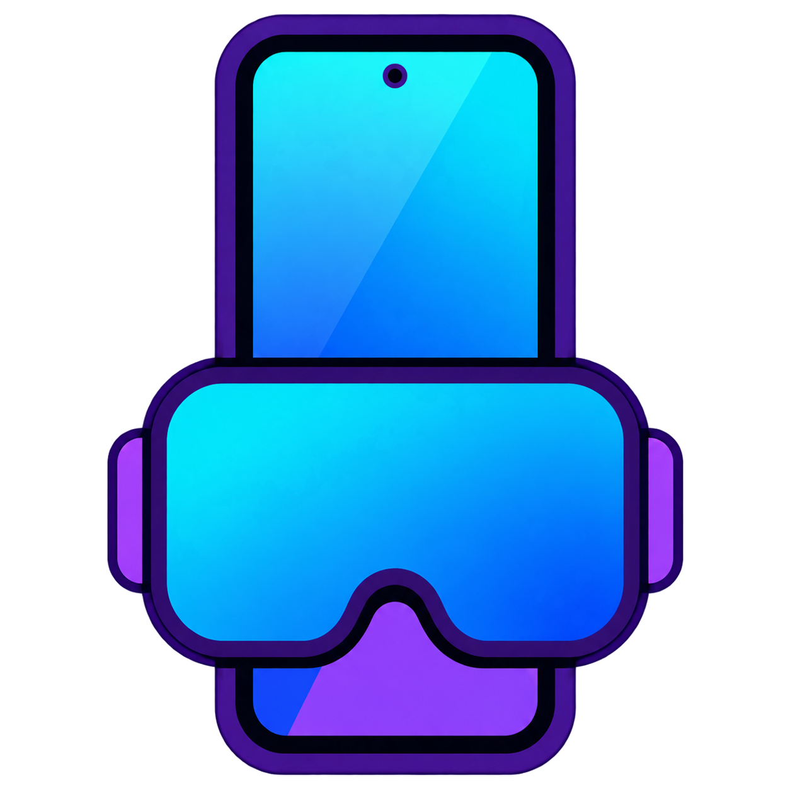
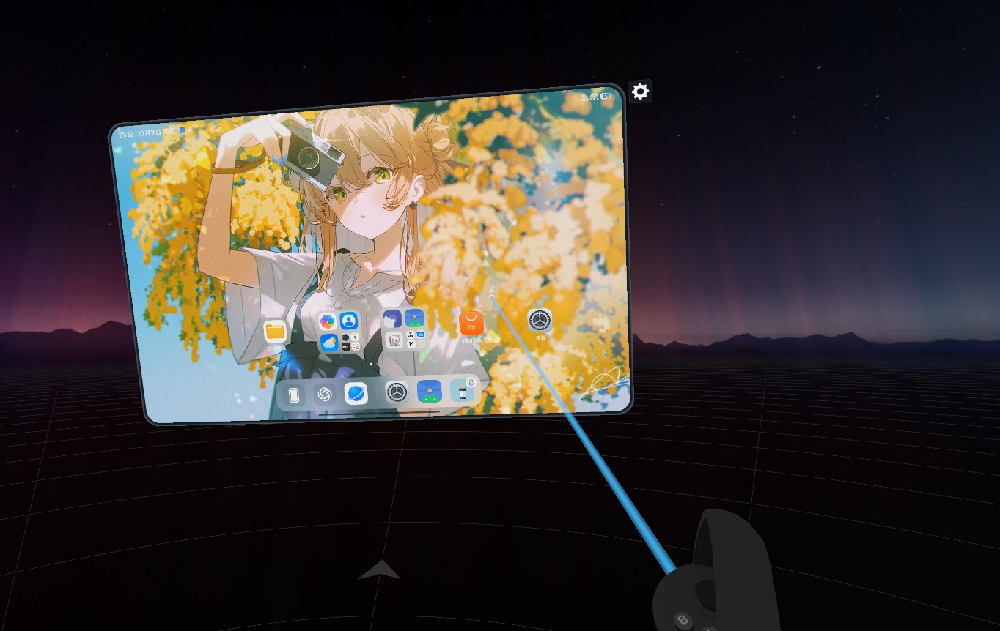
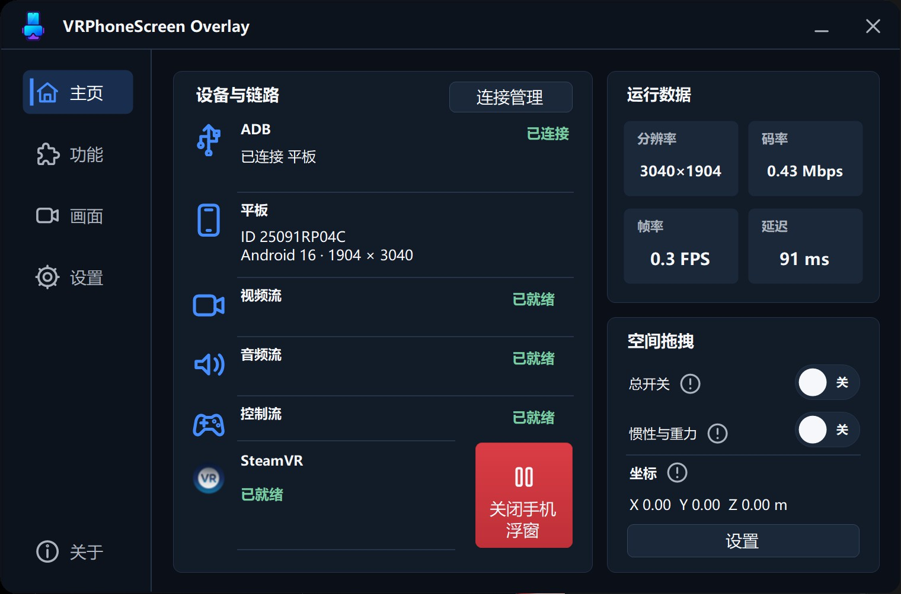
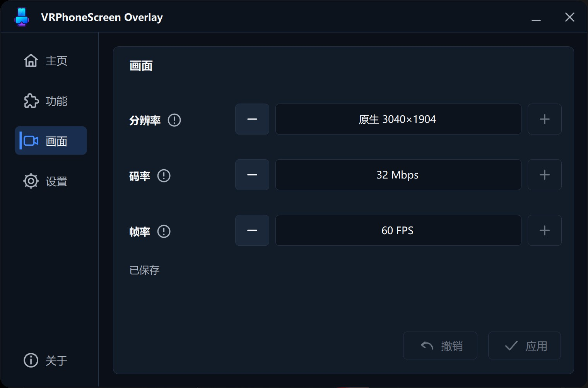

# VRPhoneScreen Overlay

**在 VR 里查看和操作你的 Android 手机。**

Windows x64 · SteamVR · Android · USB / 无线连接

**[下载方式](#下载) · [使用方法](#开始使用)**

当前版本 **0.2.7** · 解压即用

## 能做什么

| 功能 | 说明 |
| :--- | :--- |
| 操作手机 | 用手柄点击、滑动、滚动，也能返回、回到桌面和切换应用。 |
| 移动浮窗 | 抓取、缩放，放在顺手的位置；隐藏后可用手柄长按唤回。 |
| 手机声音 | 把支持采集的手机内部音频播放到电脑或头显。 |
| 有线和无线 | 支持 USB、扫码、配对码和手动 IP 连接，可记住设备。 |
| 调整画面 | 设置分辨率、码率和帧率，适应电脑性能和网络情况。 |
| 空间拖拽 | 可选功能，提供惯性、重力等设置。 |
| 手柄绑定 | 按手柄显示操作说明，可修改 SteamVR 绑定；保存后实时应用。 |
| PICO 麦克风 | 可选开启麦克风延迟改善功能。 |

<table>
<tr>
<td width="50%"> <b>主界面</b> · 查看设备、连接和运行状态</td>
<td width="50%"> <b>画面设置</b> · 按需要调整画质</td>
</tr>
</table>

截图为实际使用画面，点击图片可查看原图。

## 下载

**[GitHub 下载](https://github.com/HoshinoChika/VRPhoneScreenOverlay/releases/latest)**，或到[官网下载页](https://hoshinochika.com/vrpso/download/)下载。

下载 Windows x64 ZIP，解压后运行 `VRPhoneScreenOverlay.exe`。

## 使用要求

- Windows x64 电脑，SteamVR 正常运行。
- Android 手机或平板，需要调试授权；目前不支持 iPhone。
- 无线调试配对和内部音频通常要求 Android 11 或以上。部分系统需要额外开启输入权限。
- PICO、Quest 等头显通过电脑进入 SteamVR 使用，软件不是一体机 APK。不同设备的权限和按键可能有差别。
- 这是本机浮窗，同一个 VRChat 房间里的其他人不会自动看到你的手机。

## 开始使用

### 有线连接（USB）

1. **手机开启调试。** 在手机设置中开启开发者选项，再打开“USB 调试”。开发者选项通常需要在“关于手机”中连续点击版本号开启。
2. **连接电脑。** 用支持数据传输的 USB 线连接手机和电脑。手机出现调试授权时点击“允许”。
3. **准备头显。** 让头显连接电脑，启动 SteamVR，确认能进入 VR。
4. **运行软件。** 在电脑上解压下载的 ZIP，运行 `VRPhoneScreenOverlay.exe`。
5. **选择手机。** 进入“连接管理”，选择“USB 连接”，点击检测到的手机，再点击“连接”。没有找到时，检查授权并点击“刷新设备”。
6. **查看浮窗。** 连接后进入头显查看手机画面；如果没有自动打开，回到软件主页点击“打开手机浮窗”。
7. **开始操作。** 在软件“功能”页查看当前手柄的按键说明，再用手柄点击、滚动、移动或缩放浮窗。

部分手机还需要开启“USB 调试（安全设置）”，才能用手柄操作手机。

### 无线连接

1. **连接网络。** 手机和电脑连接同一个局域网，通常是同一个路由器；电脑可以使用网线。
2. **手机开启无线调试。** 在开发者选项中打开“无线调试”，按手机提示允许连接。
3. **准备头显。** 让头显连接电脑，启动 SteamVR，确认能进入 VR。
4. **运行软件。** 在电脑上解压下载的 ZIP，运行 `VRPhoneScreenOverlay.exe`，进入“连接管理”。
5. **选择配对方式。** 选择“无线连接（扫码）”；手机进入无线调试里的“使用二维码配对”，扫描软件显示的二维码。
6. **不能扫码时用配对码。** 在软件选择“无线连接（配对码）”，手机点击“使用配对码配对”，将手机显示的 IP、配对端口和配对码填入软件，完成配对。
7. **连接手机。** 配对完成后，在软件的设备列表中点击手机，再点击“连接”。没有出现时，保持手机亮屏并点击“刷新设备”。
8. **查看浮窗。** 连接后进入头显查看手机画面；如果没有自动打开，回到软件主页点击“打开手机浮窗”。
9. **开始操作。** 在软件“功能”页查看当前手柄的按键说明，再用手柄操作浮窗。

## 遇到问题

手机无声时，检查系统版本、音频输出和应用是否允许录音。不能操作时，检查手机的调试和输入权限。SteamVR 超时时，检查运行状态和权限。

仍有问题可在软件“关于”页填写现象并上传诊断，或到 [Issues](https://github.com/HoshinoChika/VRPhoneScreenOverlay/issues) 反馈。请说明版本、设备和复现步骤。

## 贡献者

| 贡献者 | 分工 |
| :--- | :--- |
| [HoshinoChika](https://github.com/HoshinoChika) | 提出项目想法和功能需求，负责实际使用中的测试与验收。 |
| Codex（GPT-6.1 Sol、GPT-6 Astra） | 根据需求完成实际开发，包括代码实现、问题修复和相关验证。 |

## 参考项目

本项目使用或参考了以下项目：

| 项目 / 作者 | 本项目的使用或参考 |
| :--- | :--- |
| [scrcpy](https://github.com/Genymobile/scrcpy) · Genymobile、Romain Vimont | 手机画面、音频和控制功能的基础。 |
| [OVR Advanced Settings](https://github.com/OpenVR-Advanced-Settings/OpenVR-AdvancedSettings) · Advanced Settings 团队 | 空间拖拽、惯性、重力及手柄绑定的参考。 |
| [PicoStreamingMicrophoneKeeper](https://github.com/Kill11/PicoStreamingMicrophoneKeeper) · Kill11 | PICO 麦克风延迟改善功能的参考。 |
| [OpenVR](https://github.com/ValveSoftware/openvr) · Valve | SteamVR 浮窗和手柄接口。 |

[第三方说明](THIRD_PARTY.md)

项目采用 [GPL-3.0](LICENSE)，第三方组件遵循各自许可证。
