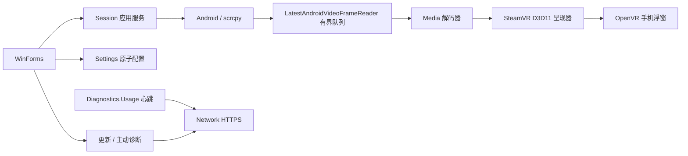

# 架构与维护入口

本文描述正式主线，不包含 PICO 麦克风端点重建实验。PICO 主线仍使用 `PicoMicrophoneKeeper` 持续读取并丢弃数据。

## 模块与依赖

| 模块 | 责任 | 不应承担 |
| --- | --- | --- |
| App/Views | WinForms 控件、页面、用户输入与状态显示 | ADB、网络、GPU 或设备调用 |
| App/Composition、Program | 启动装配、诊断快照映射、资源退出 | 视频帧处理、持久化事务 |
| Session | 手机音视频/控制生命周期、重连、设置应用与回滚 | 页面布局、HTTP 传输实现 |
| Android | ADB 发现/配对、scrcpy 会话与有界帧读取 | UI、OpenVR |
| Media | 解码、音频处理、PICO 持续消费 | 窗体状态 |
| SteamVR | 原生 VR 资源、GPU 呈现、交互、空间拖拽 | HTTP、诊断上传 |
| Settings | 配置模式、校验、迁移、原子保存与分组更新 | 手机/VR 副作用 |
| Network | HTTPS、超时、取消、重试、响应边界 | 使用统计身份或定时策略 |
| Diagnostics/Usage | 使用心跳与随机安装标识（独立于诊断上传） | 依赖诊断提交才启动、收集手机内容 |
| Diagnostics | 主动诊断、脱敏、打包、上传授权 | 改动设备状态 |
| Update / Maintenance | 签名清单、下载校验 / 事务安装、健康确认、回滚 | UI 控件 |
| Service | 更新分发、诊断接收、统计 API；故障分域 | 客户端设备能力 |
| Core / Contracts / Protocols / Presentation | 运行状态、基础契约、线协议、纯展示规则 | 平台实现 |

Sharing 目前是禁用的占位实现，PhotoSync 是预留项目；项目存在不代表功能已实现。不要为了整理而给每个小类新建项目。

## 核心链路

`PhoneVideoPipelineFactory` 由启动入口传入 `PhoneOverlayService`，默认仍创建原有 OpenVR、Media Foundation、D3D11 实现。变更工厂边界不改变帧队列、关键帧恢复、解码参数或纹理槽位。资源由会话内的原有 finally 路径释放；不要提前释放工作线程仍使用的纹理。

`PhoneMediaSessionCoordinator` 负责开始/停止、等待设备、断线重连及屏幕重启；它原有的生命周期锁和所有权保持不变。屏幕参数调整不能顺便重启手机音频。手柄与空间逻辑在 SteamVR 模块，不复制到窗体。

## 配置与线程

- UI 线程负责控件；后台状态经 UI 投递更新，不能从后台直接操作控件。
- `SettingsApplicationService` 负责保存、惯用手切换、屏幕重启及失败回滚。只有画面参数变化且浮窗活动时才重启屏幕。
- `SaveNonMotionAsync` 在设置锁内保留最新空间参数；`SaveMotionAsync` 在同一锁内合并最新非空间参数。完整 `SaveAsync` 用于明确替换整份配置的调用。
- `MotionSettingsWriter` 保持一个工作任务和一个可覆盖的最新值槽，250 ms 合并；退出时 flush。UI 不再通过补写来保证持久化一致性。
- `DiagnosticContextBuilder` 只把不可变状态快照映射到白名单字段，不查询设备、不保存文件、不持有控件。新增字段时同步做隐私检查。
- 退出先由 `UiOperationLifetime` 拒绝新 UI 操作、取消并等待已登记操作及回滚，保留消息循环直到它们完成，再 flush 空间参数；更新退出使用同一顺序。设置服务的 `DisposeAsync` 另外等待所有已接受写入，不能在 `Changed` 回调中同步重入释放自身。
- `ShutdownSequence` 即使某一步失败也继续释放其余资源；失败只记录组件名和稳定原因码，不记录异常原文。退出不将仍持有 native 资源的工作任务丢到后台后直接返回。

## 网络与服务边界

JSON 响应最多 256 KiB，实际读取字节也计数，因此不能用分块传输绕过。下载 ZIP 仍走独立下载流与自身大小/hash/签名限制。

心跳每 60 秒直连，失败等下一轮，无离线补传。服务端统计损坏时保留原文件、停用统计并记录 `USAGE_STORE_UNAVAILABLE`，不会阻止更新与诊断接口启动。不得静默把累计用户清零。

新标识登记按来源网络每小时 120 个、全局每小时 6000 个限制；既有标识心跳不消耗登记额度。地址哈希仅用于内存的一小时窗口，过期后下次登记时清理，最多 4096 项，不写统计文件。仍保留总请求限流与 25 万记录容量边界，90% 时发容量告警。统计是运营估算，不能用于结算或身份认证。

统计故障恢复：维护者备份当前文件后，用可信备份替换 `DATA_ROOT/usage/installations.json` 并重启服务；缺乏可信备份时应明确记录统计重置日期后才重新建档。接近容量时应规划数据库迁移/扩容；不要自动删除旧身份后继续宣称累计人数精确。该维护操作不在客户端自动执行。

## 验证与扩展

先构建解决方案，再运行架构检查与受影响的单元测试。项目引用白名单约束方向；新增的编译产物类型检查可发现 `using` 别名或短类型名绕过 HTTP/Process/OpenVR 禁止调用的情况。它不是所有行为的形式化证明，代码审查仍需检查所有权与取消路径。

测试使用假设备、假会话、回环 HTTP 和临时配置，不替代实际手机/VR 验收。设置事务测试用 DispatchProxy 装箱 ValueTask 是测试接口 ABI 要求，局部 CA1859 说明仅限该辅助方法。

实验分支不能自动进入正式主线。用户明确要求保留实验时，不运行将该实验合入 main 的完成脚本；先提供隔离测试包，等待用户明确合入。实验失败时回到确认基线再换方案。
